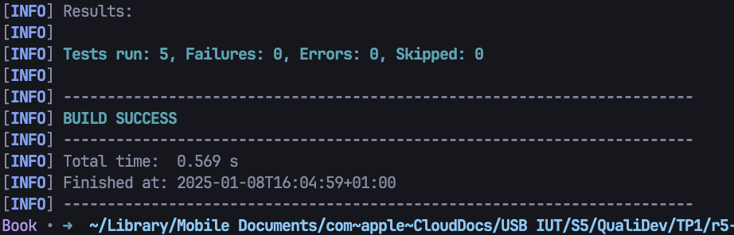

= R5.A.08 -- Dépôt pour les TPs
:icons: font
:MoSCoW: https://fr.wikipedia.org/wiki/M%C3%A9thode_MoSCoW[MoSCoW]

Ce dépôt concerne les rendus de mailto:enzo.fournet@etu.univ-tlse2.fr[Enzo Fournet].

== TP1

Fichier `ìs_it_friday_yet.feature`:

[source, cocumber]
----
Feature: Is it Friday yet?
    Everybody wants to know when it's Friday

    Scenario Outline: The day of the week
        Given today is "<day>"
        When I ask whether it's Friday yet
        Then I should be told "<answer>"

        Examples:
            | day       | answer |
            | Sunday    | Nope   |
            | Monday    | Nope   |
            | Tuesday   | Nope   |
            | Wednesday | Nope   |
            | Thursday  | Nope   |
            | Friday    | TGIF   |
            | Saturday  | Nope   |
----

Fichier `IsItFriday.java`:
[source, java]
----
public class IsItFriday {
    public String today;
    public String response;

    static String isItFriday(String today) {
        if (today.equals("Friday")) {
            return "TGIF";
        } else {
            return "Nope";
        }
    }

    @Given("today is {string}")
    public void today_is(String day) {
        this.today = day;
    }

    @When("I ask whether it's Friday yet")
    public void i_ask_whether_it_s_friday_yet() {
        this.response = isItFriday(today);
    }

    @Then("I should be told {string}")
    public void i_should_be_told(String expectedAnswer) {
        assertEquals(expectedAnswer, this.response);
    }

    @Given("today is Friday")
    public void today_is_Friday() {
        this.today = "Friday";
    }
}

----

Les test passent :

image::./hellocucumber/img/test_v1.png[]

== TP2

Fichier `Order.java`:

[source, java]
----
package dojo;

import java.util.ArrayList;
import java.util.List;

public class Order {
    private List<String> cocktails = new ArrayList<String>();
    private String owner;
    private String target;
    private String message;

    public void declareOwner(String owner) { 
        this.owner = owner;
    }

    public void declareTarget(String target) {
        this.target = target;
    }

    public void declareMessage(String message) {
        this.message = message;
    }

    public String retreiveMessage() {
        return "From " + owner + " to " + target + ": " + message;
    }

    public List<String> getCocktails() {
        return cocktails;
    }
    
}
----

Fichier `CocktailSteps.java`:

[source, java]
----
package dojo;

import static org.junit.Assert.assertEquals;

import java.util.List;

import cucumber.api.PendingException;
import cucumber.api.java.en.And;
import cucumber.api.java.en.Given;
import cucumber.api.java.en.Then;
import cucumber.api.java.en.When;

public class CocktailSteps {
    private Order order;
    @Given("{string} who wants to buy a drink")
    public void romeo_who_wants_to_buy_a_drink(String owner) {
         order = new Order();
         order.declareOwner(owner);
    }

    @When("an order is declared for {string}")
    public void an_order_is_declared_for_juliette(String to) {
            order.declareTarget(to);
    }

    @Then("there is {int} cocktails in the order")
    public void there_is_cocktails_in_the_order(Integer nbcocktails) {
        List<String> cocktails =  order.getCocktails();
        Integer cocktailsSize = cocktails.size();
        assertEquals(nbcocktails, cocktailsSize);
    }

    @And("a message saying {string} is added")
    public void a_message_saying_is_added(String message) {
        order.declareMessage(message);
    }

    @Then("the ticket must say {string}")
    public void the_ticket_must_say(String message) {
        assertEquals(message, order.retreiveMessage());
    }
}
----

Les test passent :

== TP3

fichier `calculatrice.feature`:

[source, cucumber]
----
Feature: Calculations with a calculator
  As a user
  I want to use a calculator to perform basic operations
  So that I can see the results

  Scenario Outline: Add two numbers with a calculator
    Given I have a calculator
    And I have numbers <num1> and <num2>
    When I add them
    Then the result should be <result>

    Examples:
      | num1 | num2 | result |
      | 2    | 3    | 5      |
      | 10   | 15   | 25     |
      | -1   | 4    | 3      |
      | 0    | 0    | 0      |
----

fichier `calculatrice.py`:

[source, python]
----
class Calculatrice:
    def __init__(self):
        self.resultat = 0

    def addition(self, num1, num2):
        """Additionne deux nombres."""
        self.resultat = num1 + num2
        return self.resultat

    def get_resultat(self):
        """Retourne le dernier résultat calculé."""
        return self.resultat
----

fichier `test.py`:

[source, python]
----
from behave import given, when, then
from calculatrice import Calculatrice  # Import de la classe Calculatrice

@given("I have a calculator")
def step_given_calculator(context):
    context.calculator = Calculatrice()  # Initialisation de la calculatrice

@given("I have numbers {num1:d} and {num2:d}")
def step_given_numbers(context, num1, num2):
    context.num1 = num1
    context.num2 = num2

@when("I add them")
def step_when_add(context):
    # Utilisation de la méthode addition de la calculatrice
    context.result = context.calculator.addition(context.num1, context.num2)

@then("the result should be {expected:d}")
def step_then_result(context, expected):
    # Vérification avec le résultat de la calculatrice
    assert context.result == expected, f"Expected {expected}, but got {context.result}"
----

=== Objetif

Ici j'ai voulu découvrir comment mettre en oeuvre les BDD sur un projet Python simple. Cela me permet de découvrir l'implémentation de ces tests dand un autre langage que Java. Aussi par la suite je pourrais utiliser ces méthodes de tets sur des projets beaucoup plus conséquents. Ici j'ai préférer faire simple. Mais je pourrai appliquer ces test sur plusieur librairies python que je maintiens pour faciliter le processus de tests. Car parfois il est complqiué de se retrouver dans tout les tests que l'on redige sur des gros projets.

Exemple : https://github.com/enzofrnt/djangorestframework-hybridrouter[djangorestframework-hybridrouter]

PS: Le module utiliser ici est `behave` qui est un module python qui permet de faire des tests BDD qui est semi-officiel pour cocumber, il existe aussi `pytest-bdd` mais behave semble plus populaire.