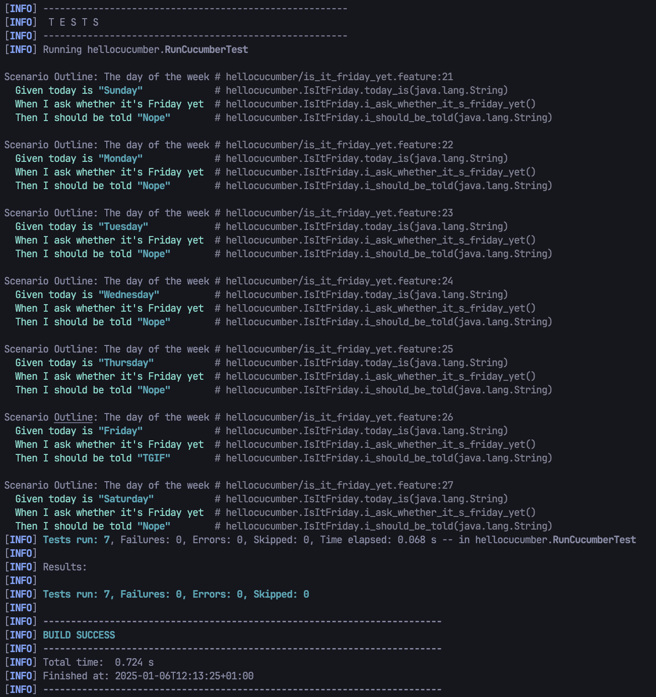

Fichier `ìs_it_friday_yet.feature`:
```feature
Feature: Is it Friday yet?
    Everybody wants to know when it's Friday

    Scenario Outline: The day of the week
        Given today is "<day>"
        When I ask whether it's Friday yet
        Then I should be told "<answer>"

        Examples:
            | day       | answer |
            | Sunday    | Nope   |
            | Monday    | Nope   |
            | Tuesday   | Nope   |
            | Wednesday | Nope   |
            | Thursday  | Nope   |
            | Friday    | TGIF   |
            | Saturday  | Nope   |
```

Les test passent :

